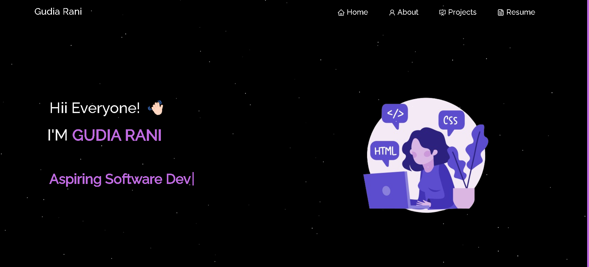

<h2 align="center">
  My Portfolio Website  
</h2>

  

 
 

## Built With

This project was built using these technologies: React.js, CSS, Bootstrap, HTML, VsCode, Vercel

## Features

**🕸️ Animations**

**🎨 Styled with React-Bootstrap**

**📱 Fully Responsive**

## Getting Started
If , want to set this project locally  
Clone down this repository. You will need `node.js` and `git` installed globally on your machine.

## 🛠 Installation and Setup Instructions

1. Installation: `npm install`

2. In the project directory, you can run: `npm start`
   
Open [http://localhost:3000](http://localhost:3000) to view it in the browser.

